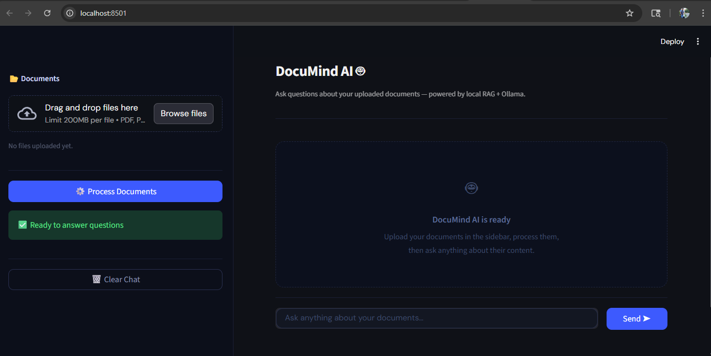
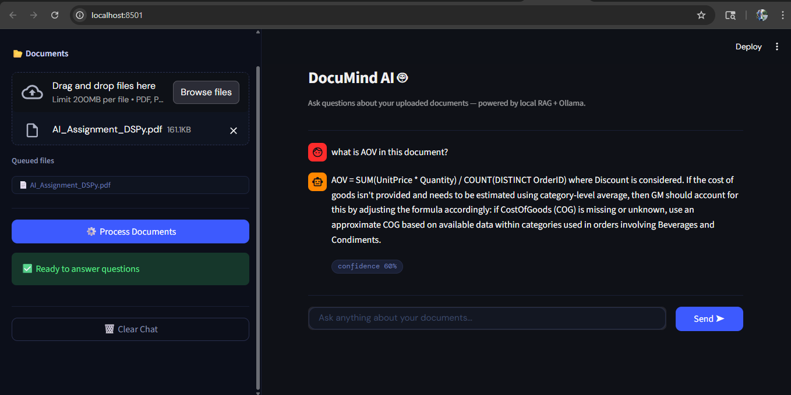

# 🚀 DocuMind AI

An intelligent AI-powered document assistant built using RAG (Retrieval-Augmented Generation) that allows users to upload PDF documents and ask contextual questions in natural language.

DocuMind AI combines Groq LLMs, FAISS vector search, and semantic embeddings to generate accurate, context-aware answers directly from uploaded documents.

---

# 🌐 Live Demo

https://fjhmzxkbql95vprmkpdexg.streamlit.app/

---

# 📌 Features

* 📄 Upload and analyze PDF documents
* 🤖 AI-powered document Q&A
* ⚡ Ultra-fast Groq LLM inference
* 🧠 Retrieval-Augmented Generation (RAG)
* 🔍 Semantic similarity search using FAISS
* 📚 Intelligent document chunking
* 🎯 Context-aware answers from uploaded files
* Modern dark-themed Streamlit UI
* 🧾 OCR fallback support for scanned PDFs/images
* 📈 Confidence score display for responses
* 🗂️ Multi-document support
* Clear chat functionality

---

# 🏗️ System Architecture

```text
User Uploads PDF
        ↓
Document Processing & Chunking
        ↓
Sentence-Transformer Embeddings
        ↓
FAISS Vector Database
        ↓
Relevant Context Retrieval
        ↓
Groq LLM (Llama 3)
        ↓
AI Generated Response
```

---

# 🛠️ Tech Stack

| Technology            | Purpose                  |
| --------------------- | ------------------------ |
| Python                | Core Backend             |
| Streamlit             | Frontend UI              |
| Groq API              | LLM Inference            |
| FAISS                 | Vector Search            |
| Sentence Transformers | Text Embeddings          |
| LangChain             | RAG Pipeline             |
| PyPDF                 | PDF Parsing              |
| OCR                   | Scanned Document Support |

---

# 📂 Project Structure

```text
DocuMind-AI/
│
├── chatbot/
│   ├── chat_engine_new.py
│   └── retriever.py
│
├── core/
│   ├── file_handler.py
│   ├── embeddings.py
│   └── utils.py
│
├── frontend/
│   └── streamlit_app.py
│
├── screenshots/
│   ├── main-ui.png
│   └── qa-demo.png
│
├── requirements.txt
├── README.md
└── .env
```

---

# 📸 Screenshots

## 🖥️ Main Interface



---

## 🤖 Document Q&A Demo



---

# ⚙️ Installation Guide

## 1️⃣ Clone Repository

```bash
git clone https://github.com/shoaib-ahmadd/DocuMind-AI.git
cd DocuMind-AI
```

---

## 2️⃣ Install Dependencies

```bash
pip install -r requirements.txt
```

---

## 3️⃣ Configure Environment Variables

Create a `.env` file in the root directory.

```env
GROQ_API_KEY=your_groq_api_key
```

---

## 4️⃣ Run the Application

```bash
streamlit run frontend/streamlit_app.py
```

---

# 🧠 How It Works

1. User uploads one or multiple PDF files.
2. Documents are cleaned and divided into chunks.
3. Text chunks are converted into embeddings.
4. Embeddings are stored inside a FAISS vector database.
5. Relevant chunks are retrieved based on semantic similarity.
6. Retrieved context is sent to the Groq LLM.
7. The model generates contextual answers grounded in uploaded documents.

---

# RAG Pipeline Used

* Document Chunking
* Embedding Generation
* FAISS Similarity Retrieval
* Context Injection
* Groq LLM Response Generation

---

# 📈 Performance Optimizations

* Optimized chunk size for better retrieval
* Adjustable top-k retrieval
* Context-aware prompting
* Fast inference using Groq APIs
* Lightweight Streamlit deployment

---

# 🚀 Future Improvements

* Multi-format support (DOCX, TXT, CSV)
* Voice input support
* Chat history persistence
* Source citation support
* Typing animation
* Better OCR pipeline
* Authentication system

---

# 👨‍💻 Author

## Shoaib Ahmad

GitHub:
https://github.com/shoaib-ahmadd

LinkedIn:
https://www.linkedin.com/in/shoaib-ahmadd

---

# ⭐ Support

If you liked this project, give it a star on GitHub.
